# דוח פרויקט - מערכת ניהול המטבח (Stage A & B)

## 📋 שער
**מגישים:** דביר דיעי ואוריה חנוכה 
**המערכת:** Restaurant Management System   
**החלק שלנו:**  Kitchen & Food Preparation Department 

**תיאור:** מערכת לניהול ותכנון עבודות במטבח – ניהול תחנות עבודה, שפים, הזמנות, משימות הכנה ובקרת היגיינה.

---

## 📑 תוכן עניינים
1. [שלב א': בניית מסד הנתונים](#שלב-א--בניית-מסד-הנתונים)
2. [שלב ב': שאילתות ואילוצים](#שלב-ב--שאילתות-ואילוצים)
3. [סטטיסטיקות דאטה](#סטטיסטיקות-דאטה)
4. [מבנה הפרויקט](#מבנה-הפרויקט)

---

# שלב א': בניית מסד הנתונים

## 🎯 מבוא
מערכת ניהול המטבח נועדה לייעל תהליכי עבודה במטבחים תעשייתיים ומסעדות. המערכת מנהלת נתונים רחבי היקף המאפשרים מעקב מקצה לקצה.

**הנתונים המנוהלים במערכת:**
* **15 תחנות עבודה**: גריל, סלטים, פסטה, הכנות ועוד.
* **60 שפים**: ניהול עובדים לפי התמחויות (Grill Master, Pastry Chef וכו').
* **510 הזמנות**: מעקב סטטוס (Pending, In-Prep, Ready, Served).
* **20,010 משימות הכנה**: פירוט כל הזמנה למשימות ביצוע.
* **20,010 רישומי הכנה**: תיעוד הביצוע בפועל על ידי הצוות.
* **510 בדיקות היגיינה**: בקרת איכות, ניקיון וטמפרטורה.

---

## 🖥️ מסכי המערכת
להלן עיצוב תיאורטי (Mockups) של ממשק המשתמש העתידי של המערכת:

### מסך 1: דשבורד ראשי
צפייה בזמן אמת בהזמנות וסטטוס התחנות.  
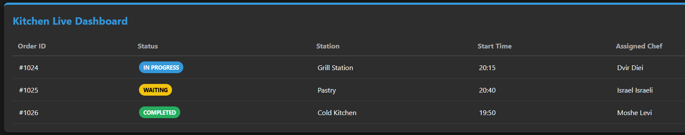

### מסך 2: ניהול תחנות
סקירת פעילות התחנות והשפים המוקצים אליהן.  
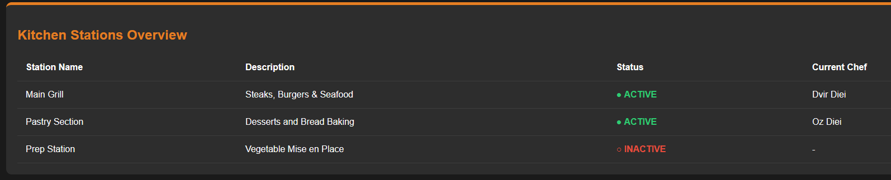

### מסך 3: ניהול צוות שפים
רשימת השפים, התמחויות וסטטוס משמרת.  
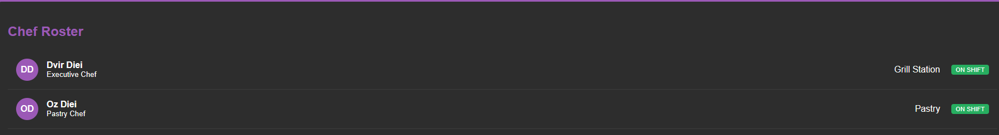

### מסך 4: בקרת היגיינה
דוח ריכוז בדיקות בטיחות מזון וניקיון.  
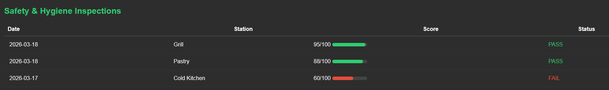

---

## 📊 תרשימים

### ERD - Entity Relationship Diagram
מבנה הקשרים הלוגיים בין הישויות במערכת:  
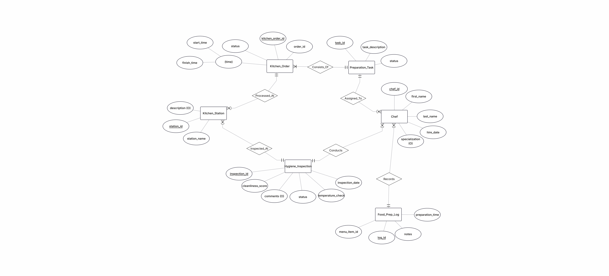

### DSD - Detailed Structure Diagram
פירוט מבנה הטבלאות, סוגי נתונים ומפתחות:  
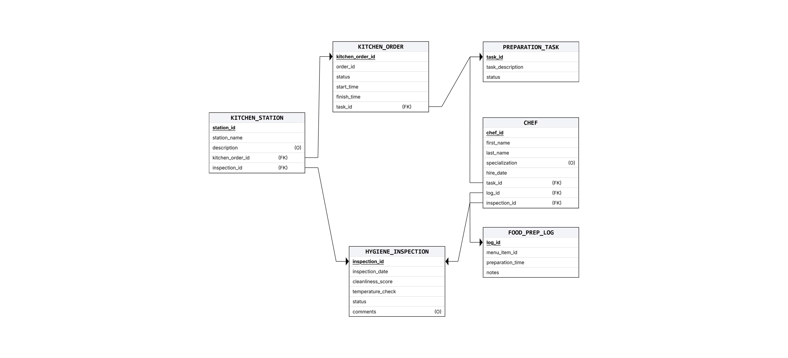

---

## 🎓 החלטות עיצוב

1.  **PostgreSQL 17.1**: נבחרה בשל היכולת לנהל Transactions מורכבים, תמיכה ב-Constraints חזקים וביצועים גבוהים בנתונים רלציוניים.
2.  **מפתחות (PK)**: שימוש ב-`GENERATED BY DEFAULT AS IDENTITY` להבטחת מספור אוטומטי וייחודי.
3.  **סטטוסים (Enum)**: הגבלת ערכי הסטטוס (כמו 'Pending', 'Ready') למניעת שגיאות הקלדה ושמירה על שלמות הנתונים.
4.  **אילוצים מספריים**: הגבלת ציוני היגיינה לטווח 1.0-10.0 וטמפרטורות לדיוק של 2 ספרות עשרוניות.

---

## 📥 שיטות הכנסת נתונים

### שיטה 1: CSV Import (kitchen_station)
שימוש בפקודת `COPY` לייבוא נתונים סטטיים של תחנות עבודה מתוך קובץ CSV.  
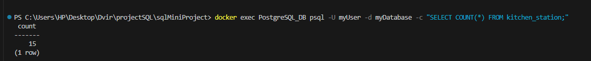

### שיטה 2: Mockaroo SQL (chef)
ייבוא 60 שפים עם נתונים אמינים (שמות, תאריכי העסקה) באמצעות סקריפט SQL מוכן.  
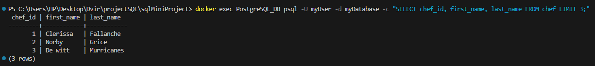

### שיטה 3: Python-Generated SQL
שימוש בסקריפטים של Python ליצירת מעל 40,000 רשומות של הזמנות, משימות ורישומי הכנה.  
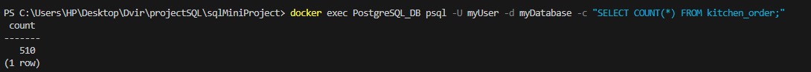

---

## 💾 גיבוי ושחזור נתונים

### גיבוי מלא
ביצוע Dump מלא של בסיס הנתונים כולל מבנה ונתונים לקובץ SQL חיצוני.  
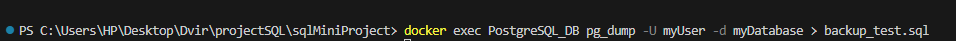

### שחזור מגיבוי
תהליך טעינת הנתונים מקובץ גיבוי לשרת ריק לשחזור מלא של המצב הקודם.  
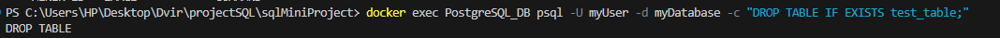

---

## 📊 סטטיסטיקות דאטה

| טבלה | מספר רשומות | גודל מוערך |
| :--- | :--- | :--- |
| kitchen_station | 15 | ~1 KB |
| chef | 60 | ~5 KB |
| kitchen_order | 510 | ~50 KB |
| preparation_task | 20,010 | 2.8 MB |
| food_prep_log | 20,010 | 2.6 MB |
| hygiene_inspection | 510 | ~50 KB |
| **סה"כ** | **51,115+** | **~5.5 MB** |

---

# 🔷 שלב ב': שאילתות ואילוצים - דוח מפורט

## 📌 מבוא לשלב ב'
בשלב זה ביצענו תשאול מעמיק של בסיס הנתונים באמצעות שאילתות מתקדמות, הוספנו אילוצים עסקיים, והדגמנו ניהול עסקאות (Transactions) עם COMMIT ו-ROLLBACK.

### קבצי שלב ב':
- `stage-B/Queries.sql` - 8 שאילתות SELECT + 3 UPDATE + 3 DELETE
- `stage-B/Constraints.sql` - 8 אילוצים עם ALTER TABLE וניסיונות הפרה
- `stage-B/RollbackCommit.sql` - הדגמות של ROLLBACK ו-COMMIT
- `stage-B/backup2.sql` - גיבוי מעודכן של בסיס הנתונים

---

## 🔍 PAIR 1: חלוקת עומס עבודה לפי תחנות (Workload Distribution)

**תיאור השאילתה (מטרה עסקית):** שאילתה זו מציגה את עומס העבודה הנוכחי בכל תחנה במטבח. היא סופרת את סך ההזמנות לכל תחנה, ומפלגת אותן לפי סטטוסים (כמה בהמתנה, בהכנה, מוכנות וכו'). המטרה היא לאפשר למנהל המטבח לזהות "צווארי בקבוק" בזמן אמת (למשל, עומס חריג של מנות "בהמתנה" בתחנת הגריל) ולהפנות כוח אדם בהתאם.

### גישה א': שימוש ב-JOIN עם פונקציות אגרגציה (CASE) - קוד, הרצה ותוצאה


### גישה ב': שימוש בטבלה זמנית (CTE) - קוד, הרצה ותוצאה


**הסבר על ההבדלים - מה יותר יעיל ולמה?** במקרה של השאילתה הזו, **גישה א' (JOIN) יעילה יותר**.

* **גישה א' (JOIN + CASE):** מבצעת סריקה אחת בלבד (Single Pass) של הנתונים. מסד הנתונים קורא את הטבלאות, מחבר אותן, ומיד מחשב את הסיכומים באמצעות פונקציות ה-`SUM(CASE...)`. זו פעולה ישירה שחוסכת במשאבי עיבוד.
* **גישה ב' (CTE):** עובדת בשני שלבים. קודם כל היא יוצרת בזיכרון טבלה זמנית (ה-CTE) המסכמת את הנתונים, ורק אז שולפת ומעצבת אותם לתוצאה הסופית. 
* **השורה התחתונה:** גישה ב' מוסיפה "תקורה" (Overhead) ושלב עיבוד מיותר. אמנם קוד עם CTE נראה לרוב קריא ומסודר יותר לעין האנושית, אך מבחינת ביצועי מנוע ה-SQL, גישה א' מהירה ופשוטה יותר לביצוע.

---

## 🔍 PAIR 2: איתור שפים עם משימות דחופות (IN vs EXISTS)

**תיאור השאילתה (מטרה עסקית):** שאילתה זו מאתרת שפים שמטפלים כרגע במשימות בעדיפות קריטית (רמה 4 ומעלה) שעוד לא הסתיימו. המטרה היא לשקף למנהל המטבח על מי מהצוות יש עומס של מנות דחופות, ולמי ניתן להקצות משימות חדשות מבלי לגרום לעיכובים.

### גישה א': שימוש ב-IN - קוד, הרצה ותוצאה


### גישה ב': שימוש ב-EXISTS (שאילתה קורלטיבית) - קוד, הרצה ותוצאה


**הסבר על ההבדלים - מה יותר יעיל ולמה?**
במערכת כמו שלנו, שמכילה המון נתונים (עשרות אלפי משימות), **גישה ב' (EXISTS) יעילה משמעותית**.

* **גישה א' (IN):** עובדת בשני שלבים. קודם כל היא סורקת את כל טבלת המשימות, מוצאת את כל ה-IDs הרלוונטיים, ובונה מהם רשימה זמנית בזיכרון. רק אז היא בודקת איזה שף נמצא ברשימה. זה פחות יעיל כשהרשימה הפנימית ענקית.
* **גישה ב' (EXISTS):** עובדת בשיטת "האם קיים?". היא בודקת כל שף, וברגע שהיא מוצאת לו משימה דחופה *אחת בלבד* – היא מיד מפסיקה את החיפוש עבורו (פעולה הנקראת Short-Circuit) וממשיכה לשף הבא. אין צורך לאסוף את כל המשימות שלו לזיכרון, מה שחוסך זמן עיבוד יקר.

---

## 🔍 PAIR 3: ניתוח משך זמן הכנת הזמנות (EXTRACT vs DATE_TRUNC)

**תיאור השאילתה (מטרה עסקית):** שאילתה זו מחשבת את משך הזמן המדויק (בדקות) שלקח להכין כל הזמנה – מרגע קבלתה ועד לסיומה. לאחר מכן, היא מסווגת כל הזמנה לקטגוריית ביצועים (מהיר: פחות מ-30 דקות, בינוני: 30-60 דקות, איטי: מעל שעה). המטרה היא לבקר את איכות השירות (SLA) ולזהות הזמנות שחרגו מזמן התקן המקובל במסעדה.

### גישה א': שימוש ב-EXTRACT לחילוץ רכיבי זמן - קוד, הרצה ותוצאה


### גישה ב': שימוש ב-DATE_TRUNC לקיבוץ תקופות - קוד, הרצה ותוצאה


**הסבר על ההבדלים - מתי נשתמש בכל צורה ולמה?**
בשאילתה זו, עיקר חישוב משך הזמן מתבצע בשתי הגישות על ידי מתמטיקה של תאריכים (`EPOCH`), ולכן זמני הריצה שלהן דומים. ההבדל המשמעותי ביניהן הוא בדרך שבה הן מטפלות בתצוגת התאריכים (שנה/חודש/יום):

* **גישה א' (EXTRACT):** מפרקת את התאריך ו"שולפת" ממנו מספרים בודדים (למשל: החזר את המספר 5 עבור חודש מאי). היא מספקת **גמישות מקסימלית** כשרוצים להציג כל חלק בעמודה נפרדת לצורך קריאה נוחה של בני אדם.
* **גישה ב' (DATE_TRUNC):** במקום לפרק, היא "מעגלת" את התאריך (Truncation). לדוגמה, כל תאריך בחודש מאי יהפוך ל-`2026-05-01 00:00:00`. גישה זו **מצוינת לקיבוץ נתונים (Grouping)**. בנוסף, היא בטוחה יותר לעבודה מול שינויי אזורי זמן (Timezone-safe), כי היא שומרת על אובייקט מסוג תאריך במקום להפוך אותו למספר "יתום" וחסר הקשר כמו ב-EXTRACT.
* **השורה התחתונה:** אם המטרה היא רק להציג את הנתון במסך ללקוח - `EXTRACT` קלה ונוחה. אם המטרה היא להכין את הנתונים לגרפים או לניתוח תקופתי במערכות BI - הגישה הנכונה והיעילה היא `DATE_TRUNC`.

---

## 🔍 PAIR 4: מגמות עומס חודשיות לפי תחנה (EXTRACT vs DATE_TRUNC)

**תיאור השאילתה (מטרה עסקית):** שאילתה זו מנתחת את הביצועים ואת עומס העבודה של כל תחנת עבודה ברמה החודשית (כמה הזמנות התקבלו בסך הכל, כמה מתוכן הושלמו בהצלחה, ומה היה זמן ההכנה הממוצע). המטרה היא לאפשר להנהלה לזהות מגמות עונתיות (למשל עומס חריג בחודש מסוים), לחזות עומסים עתידיים, ולתכנן את שיבוץ כוח האדם למשמרות בצורה חכמה יותר.

### גישה א': שימוש במספר פונקציות חילוץ וטקסט (EXTRACT & TO_CHAR) - קוד, הרצה ותוצאה


### גישה ב': שימוש בפונקציית עיגול תאריכים (DATE_TRUNC) - קוד, הרצה ותוצאה


**הסבר על ההבדלים - מה יותר יעיל ולמה?**
לצורך קיבוץ נתונים (Grouping) על ציר הזמן, **גישה ב' (DATE_TRUNC) יעילה ומומלצת יותר**.

* **גישה א' (EXTRACT):** כדי לקבץ את הנתונים לפי חודשים, מנוע ה-SQL נאלץ להפעיל שלוש קריאות נפרדות לפונקציות עבור כל שורה ושורה בטבלה (לחלץ שנה בנפרד, לחלץ חודש בנפרד, ולהמיר לטקסט מעוצב). זה מעמיס על המעבד ללא צורך.
* **גישה ב' (DATE_TRUNC):** מבצעת פעולה מתמטית קלה ומהירה אחת בלבד ש"מיישרת" את התאריכים (למשל, ממירה כל תאריך במהלך פברואר ל-`2026-02-01`). שיטה זו יוצרת "סלים" מדויקים של זמנים (Consistent Bucketing) ללא מאמץ עיבודי כבד.
* **השורה התחתונה:** כשרוצים לקבץ רשומות לתקופות זמן מוגדרות (ברמת החודש, השבוע או הרבעון) לצורך דוחות אנליטיים, שימוש בפונקציה יחידה של `DATE_TRUNC` יבטיח זמן ריצה מהיר יותר וקוד נקי יותר ממספר קריאות לפונקציית `EXTRACT`.
---

## 📊 QUERY 5: Hygiene Inspection Scores
**תיאור השאילתה (מטרה עסקית):** שאילתה זו מציגה תמונת מצב חודשית מקיפה על עמידתן של תחנות המטבח בתקני ההיגיינה. היא מסכמת את כלל הביקורות שנערכו בכל חודש לכל תחנה, ומחשבת את ציון הניקיון הממוצע, הציון הנמוך ביותר, הגבוה ביותר, ואת הטמפרטורה הממוצעת שנמדדה בציוד הקירור. המטרה היא לאפשר להנהלה לעקוב אחר מגמות בטיחות מזון, לזהות תחנות ש"מזייפות" או מזלזלות בנהלים לאורך זמן (על ידי בחינת ציון הניקיון המינימלי), ולמנוע סכנות בריאותיות ללקוחות המסעדה.


---

## 📊 QUERY 6: Chef Productivity
**תיאור השאילתה (מטרה עסקית):** שאילתה זו מנתחת את הביצועים ויעילות העבודה של כל שף במטבח על בסיס חודשי. היא מחשבת כמה מנות כל שף הכין בסך הכל, מהו זמן ההכנה הממוצע שלו, וכן מהם זמני ההכנה המהיר והאיטי ביותר שלו. המטרה היא לאפשר להנהלה להעריך את צוות העובדים, לזהות שפים מצטיינים ומהירים, ולאתר עובדים שזקוקים להדרכה נוספת (לדוגמה, כאלו שזמן ההכנה הממוצע שלהם ארוך משמעותית משאר הצוות). השאילתה משתמשת בתנאי `HAVING` כדי לסנן החוצה שפים שהכינו פחות מ-5 מנות באותו חודש, במטרה למנוע מצב שבו מנה בודדת מהירה או איטית במיוחד מטה את הממוצע הכללי של השף.


---

## 📊 QUERY 7: Active Tasks by Priority
**תיאור השאילתה (מטרה עסקית):** שאילתה זו מספקת למנהל המשמרת (השף הראשי) תמונת מצב חיה (Real-time) על כל המשימות הפעילות במטבח (בסטטוס 'Pending' או 'In-Prep') בעלות עדיפות בינונית-גבוהה (רמה 3 ומעלה). השאילתה מפרטת מי השף שאחראי על המשימה, באיזו תחנה היא מבוצעת, ומחשבת באופן דינמי כמה דקות חלפו מאז שההזמנה המקורית התקבלה (`minutes_elapsed`). המטרה היא לאפשר ניהול תורים חכם, חלוקת עומסים ותעדוף בזמן אמת על רצפת המטבח, ומניעת עיכובים בהגשת מנות ללקוחות.


---

## 📊 QUERY 8: Temperature Anomalies
**תיאור השאילתה (מטרה עסקית):** זוהי שאילתת בקרה קריטית המיועדת להבטיח עמידה בתקני משרד הבריאות. היא סורקת את כל בדיקות ההיגיינה ומתעדת את הטמפרטורות שנמדדו במקררים ובמקפיאים. באמצעות משפט `CASE`, המערכת מסווגת כל מדידה לרמת סיכון (החל מ-"תקין", דרך "חמים - סיכון" ועד "חם - קריטי"). המטרה היא להציג למנהל המשמרת דוח מיידי על תקלות בציוד הקירור, כשהוא ממוין כך שהחריגות החמורות ביותר (מעל 15 מעלות) יופיעו תמיד בראש הרשימה, כדי למנוע קלקול מזון וסיכון בריאותי.


---

## ✏️ UPDATE 1: Orders Ready
**תיאור השאילתה (מטרה עסקית):** שאילתה זו מבצעת עדכון סטטוס אוטומטי (מ-'In-Prep' ל-'Ready') עבור הזמנות שכל משימות ההכנה שלהן במטבח הושלמו. המטרה היא לייעל את עבודת הצוות ולחסוך מהשף הראשי את הצורך לעדכן ידנית כל הזמנה, תוך הבטחה שהזמנות מסומנות כמוכנות להגשה רק כשבאמת כל המנות שלהן סוימו. (בצילומי המסך ניתן לראות כיצד המערכת איתרה ועדכנה 5 הזמנות במקביל).

**לפני:** 
**הרצה:** 
**אחרי:** 

---

## ✏️ UPDATE 2: Chef Station Assignment
**תיאור השאילתה (מטרה עסקית):** שאילתה לניהול דינמי של כוח אדם במשמרת. היא נועדה להעביר שף ספציפי (לפי תעודת זהות / ID) לתחנת עבודה אחרת, כדי לאזן עומסים במטבח בזמן אמת ולמנוע צווארי בקבוק בתחנות לחוצות.

**לפני:** 
**הרצה:** 
**אחרי:** 

---

## ✏️ UPDATE 3: Next Inspection Date
**תיאור השאילתה (מטרה עסקית):** תהליך אוטומטי לבקרת איכות ובטיחות מזון. השאילתה סורקת את בדיקות הניקיון שבוצעו בחודש מסוים, ומגדירה אוטומטית את תאריך היעד לביקורת הבאה ל-7 ימים בדיוק לאחר תאריך הבדיקה הנוכחית, כדי לוודא עמידה רציפה בתקני משרד הבריאות.

**לפני:** 
**הרצה:** 
**אחרי:** 

---

## 🗑️ DELETE 1: Old Cancelled Orders
**תיאור השאילתה (מטרה עסקית):** שאילתה זו מוחקת מהמערכת הזמנות שבוטלו (Status = 'Cancelled') לפני למעלה מ-90 יום. מחיקה זו חיונית למניעת "נפיחות" של מסד הנתונים (Database Bloat) ומבטיחה ששאילתות הניהול היומיומיות ירוצו מהר יותר על נתונים רלוונטיים בלבד. 
*הערה טכנית:* השאילתה מבוצעת בשלבים (באמצעות CTE) כדי לנקות תחילה את המשימות המקושרות ולמנוע שגיאת Foreign Key.

**לפני:** 
**הרצה:** 
**אחרי:** 

---

## 🗑️ DELETE 2: Duplicate Prep Logs
**תיאור השאילתה (מטרה עסקית):** שאילתה לטיוב נתונים (Data Cleaning). היא מאתרת רשומות ביומן העבודה שנוצרו בטעות פעמיים (עבור אותו שף, אותה מנה ובאותו תאריך) ומוחקת את הכפילויות המאוחרות יותר. השאילתה שומרת רק את הרשומה המקורית ביותר (`MIN(log_id)`), ובכך מבטיחה דוחות פרודוקטיביות אמינים ומדויקים.

**לפני:** 
**הרצה:** 
**אחרי:** 

---

## 🗑️ DELETE 3: Tasks for Cancelled Orders
**תיאור השאילתה (מטרה עסקית):** שאילתה זו מנקה משימות הכנה (Tasks) המשויכות להזמנות שכבר בוטלו מזמן (מעל 60 יום). שמירה על המשימות הללו יוצרת "רעש" מיותר ברשימות העבודה של השפים ובדוחות המלאי. המחיקה מבטיחה שכל משימה בבסיס הנתונים משויכת להזמנה פעילה או רלוונטית בלבד.

**לפני:** 
**הרצה:** 
**אחרי:** 

---

## 🔒 CONSTRAINT 1: Finish Time After Start
**הסבר:** מוודא שזמן סיום ההזמנה במטבח לא יהיה מוקדם מזמן ההתחלה שלה. זה מונע שגיאות הקלדה ושומר על סדר כרונולוגי תקין במערכת.

**ALTER:** 
**שגיאה:** 

---

## 🔒 CONSTRAINT 2: Positive Prep Time
**הסבר:** מבטיח שזמן הכנת המנה יהיה תמיד מספר חיובי הגדול מאפס. לא ניתן להזין זמן הכנה שלילי או אפסי, מה שמבטיח נתונים ריאליים.

**ALTER:** 
**שגיאה:** 

---

## 🔒 CONSTRAINT 3: Next Inspection After Current
**הסבר:** מוודא שתאריך הביקורת הבאה שנקבע תמיד יהיה מאוחר יותר מתאריך הביקורת הנוכחית. אילוץ זה מונע סתירות בלוח הזמנים של הביקורות.

**ALTER:** 
**שגיאה:** 

---

## 🔒 CONSTRAINT 4: Valid Task Status
**הסבר:** מגביל את שדה הסטטוס של משימה לרשימה סגורה של ערכים מוגדרים (כמו Pending, Ready וכו'). מונע הזנת מצבים שאינם קיימים בתהליך העבודה.

**ALTER:** 
**שגיאה:** 

---

## 🔒 CONSTRAINT 5: Unique Station Names
**הסבר:** מוודא שלא יהיו שתי תחנות עבודה במטבח עם אותו שם. השם חייב להיות ייחודי לכל תחנה לצורך זיהוי מהיר ומניעת בלבול.

**ALTER:** 
**שגיאה:** 

---

## 🔒 CONSTRAINT 6: Hire Date Not Future
**הסבר:** מונע הזנת תאריך העסקה עתידי עבור שפים. תאריך ההעסקה חייב להיות תאריך של היום או מהעבר, מה ששומר על אמינות רישומי כוח האדם.

**ALTER:** 
**שגיאה:** 

---

## 🔒 CONSTRAINT 7: Priority Level (1-5)
**הסבר:** אילוץ זה כבר הוגדר כחלק ממבנה הטבלה המקורי (Stage A). הוא מוודא שרמת העדיפות של משימה תהיה בטווח שבין 1 ל-5 בלבד.

**שגיאה:** 

---

## 🔒 CONSTRAINT 8: Cleanliness Score (1.0-10.0)
**הסבר:** אילוץ זה כבר הוגדר כחלק ממבנה הטבלה המקורי (Stage A). הוא מגביל את ציון הניקיון בביקורת לטווח שבין 1.0 ל-10.0, למניעת חריגות בנתוני הביקורת.

**שגיאה:** 

---

# 🔄 Transaction Management - ROLLBACK & COMMIT

קבצי ה-SQL הבאים מדגימים את היכולת של מסד הנתונים לנהל טרנזקציות, המאפשרות לבצע סדרת פעולות כיחידה אחת ולבחור האם לשמור אותן או לבטלן במקרה של טעות.

---

## 🔄 Scenario 1: ROLLBACK - Transaction Undo
**הסבר:** תרחיש זה מדגים כיצד ניתן לבטל שינויים שבוצעו. עדכנו סטטוס של משימה, אך בחרנו לבצע `ROLLBACK` שמחזיר את הנתונים למצבם המקורי כאילו לא קרה דבר.

1. **בדיקת המצב הראשוני:** הצגת המשימה לפני השינוי.


2. **ביצוע העדכון (בתוך טרנזקציה):** שינוי הסטטוס ל-'In-Prep' והעלאת רמת העדיפות.


3. **ביטול השינויים (ROLLBACK):** החזרת המשימה למצבה המקורי ובדיקה שהנתונים אכן חזרו לקדמותם.


---

## 🔄 Scenario 2: COMMIT - Transaction Permanent
**הסבר:** תרחיש זה מדגים שמירת שינויים לצמיתות. כאן אנו מעדכנים פרטי שף (תחנה וסטטוס משמרת) ומבצעים `COMMIT` כדי לקבע את השינוי במסד הנתונים.

1. **בדיקת המצב הראשוני:** הצגת נתוני השף לפני העדכון.


2. **ביצוע העדכון:** שינוי התחנה והגדרת השף כנמצא במשמרת.


3. **אישור השינויים (COMMIT):** שמירת השינויים בבסיס הנתונים ווידוא שהם נשמרו גם לאחר סיום הטרנזקציה.


---

## 💾 Scenario 3: SAVEPOINT - Partial Rollback (Bonus)
**הסבר:** שימוש ב-`SAVEPOINT` מאפשר לנו לבצע "נקודות שמירה" בתוך טרנזקציה ארוכה. בדוגמה זו, ביצענו מחיקה של הזמנות ישנות ועדכון שפים, אך בחרנו לבטל **רק** את עדכון השפים ולשמור את המחיקה.

* **שלב 1:** יצירת נקודת שמירה ומחיקת הזמנות מבוטלות.
* **שלב 2:** עדכון סטטוס שפים ויצירת נקודת שמירה נוספת.
* **שלב 3:** ביצוע `ROLLBACK TO` לנקודה שלפני עדכון השפים - מה שמבטל רק את העדכון האחרון.
* **שלב 4:** ביצוע `COMMIT` סופי ששומר רק את פעולת המחיקה.

---

# שלב ג' - אינטגרציה ומבטים (Integration & Views)

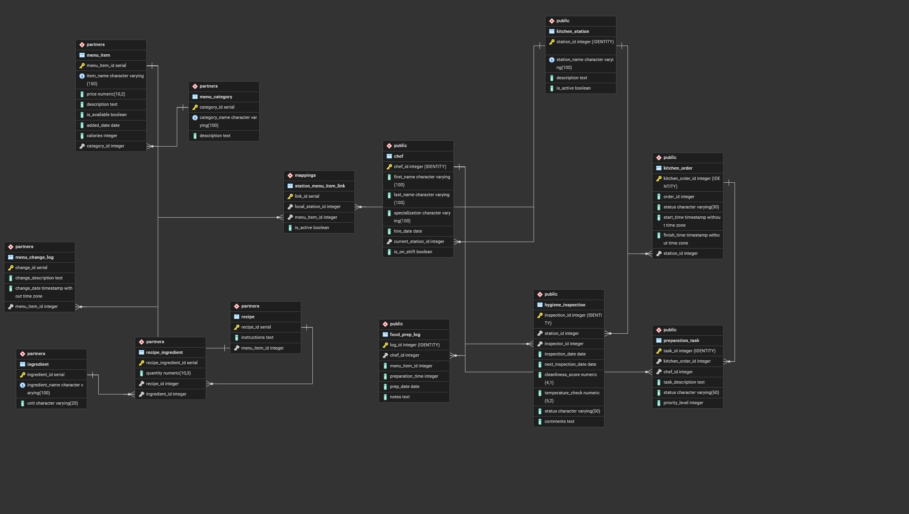

## 1. מבוא ואסטרטגיית האינטגרציה
בשלב זה בוצעה אינטגרציה בין שני בסיסי נתונים נפרדים:

1. **אגף ניהול המטבח (Kitchen Management):** ניהול עמדות פס חם/קר, ציוד ותפעול שוטף (הסכמה `public`).
2. **אגף ניהול התפריט והמתכונים (Menu & Recipes):** ניהול מנות, מרכיבים, קטגוריות ומתכונים (הסכמה `partners`).

**ההחלטה הארכיטקטונית:** במקום למזג את הטבלאות פיזית ולפגוע בעצמאות של כל אגף (מה שעלול לגרום לאיבוד מידע או כפילויות), נבחרה גישת אינטגרציה מבוססת טבלת גישור (Junction Table). כדי לשמור על סדר ארגוני ברמת מסד הנתונים, הוקמה סכמה ייעודית חדשה בשם `mappings`. סכמה זו משמשת כשכבת התווך (Middleware) שמחברת בין עמדות המטבח הפיזיות לבין פריטי התפריט הווירטואליים, מבלי לשנות את טבלאות המקור.

## 2. יצירת שכבת הקישור (Mapping Layer)
הוקמה טבלת גישור מרכזית: `mappings.station_menu_item_link`.

- **מפתחות זרים (Foreign Keys):** הטבלה מקשרת בין `station_id` (מעולם המטבח) לבין `menu_item_id` (מעולם התפריט).
- **מניעת כפילויות:** הוגדר אילוץ `UNIQUE (local_station_id, menu_item_id)` כדי למנוע מצב שבו מנה משויכת לאותה עמדה פעמיים.
- **גמישות תפעולית:** הוסף שדה `is_active (BOOLEAN)` כדי לאפשר השעיה זמנית של הכנת מנה בעמדה מסוימת, מבלי למחוק את הרשומה מהיסטוריית מסד הנתונים.

## 3. היגיון עסקי - הזנת נתונים (Data Population)
לצורך בדיקת המערכת, בוצע תהליך מיפוי (Mapping) רחב היקף של כ-500 פריטי תפריט ל-15 עמדות המטבח השונות.
**החלטת אינטגרציה:** המיפוי לא בוצע באופן אקראי, אלא על בסיס היגיון קולינרי ותפעולי המחקה מסעדה אמיתית:

- מנות הכוללות בקר, טלה או חזיר נותבו לעמדת ה-**Grill Station**.
- משקאות, אלכוהול וקפה נותבו ל-**Beverage Station**.
- מוצרי מאפה, קמחים וקינוחים נותבו ל-**Pastry Station**.
- דגים ופירות ים שויכו ל-**Seafood Station**.
- פריטים כלליים או לא מזוהים שויכו לעמדת ברירת המחדל - **Prep Station**.
  נתונים אלו הוזנו לטבלה באמצעות פקודת `INSERT` מרוכזת (המצורפת בקובץ ה-SQL).

## 4. תצוגות (Views) - חשיפת המידע המשותף
כדי להנגיש את המידע המשולב למשתמשי הקצה, נוצרו שתי תצוגות מרכזיות, כל אחת משרתת אגף אחר בארגון:

### מבט 1: נקודת המבט של מנהל המטבח (`view_station_responsibilities`)

- **מטרה:** להציג לכל טבח או מנהל עמדה אילו מנות נמצאות תחת אחריותו.
- **מבנה:** המבט שואב את שם העמדה ותיאורה (מטבלת המטבח), ומשלב אותם עם שם המנה וסטטוס הזמינות שלה (מטבלת השותף), דרך טבלת הקישור.
- **יתרון עסקי:** צוות המטבח לא נדרש להכיר את מבנה הנתונים המורכב של המתכונים. הוא מקבל רשימת עבודה שקופה וברורה לכל עמדה.

**רעיון עסקי:** זהו לוח עבודה תפעולי לרצפת הייצור. מנהל מטבח יכול לראות בזמן אמת איזו מנה שייכת לכל עמדה והאם היא זמינה, וכך לבצע איזון עומסים בין עמדות, לתעדף הכנה ולמנוע צווארי בקבוק בשעות עומס.

**קוד השאילתה (מתוך `stage-C/Views.sql` + שליפת פלט):**

```sql
CREATE VIEW mappings.view_station_responsibilities AS
SELECT 
  ks.station_name,
  ks.description,
  mi.item_name,
  mi.is_available
FROM public.kitchen_station ks
JOIN mappings.station_menu_item_link smil ON ks.station_id = smil.local_station_id
JOIN partners.menu_item mi ON smil.menu_item_id = mi.menu_item_id;

SELECT *
FROM mappings.view_station_responsibilities
LIMIT 10;
```

**פלט:**


### מבט 2: נקודת המבט של השף / מנהל התפריט (`view_partner_recipe_routing`)

- **מטרה:** להראות למנהלי התפריט היכן כל מנה ומתכון מוכנים בפועל במטבח.
- **מבנה:** מבט מורכב המשלב 4 טבלאות שונות (`menu_item`, `menu_category`, `recipe`, `kitchen_station`).
- **החלטה טכנית:** נעשה שימוש ב-`LEFT JOIN` מול טבלת המתכונים (`recipe`), כדי להבטיח שגם מנות שטרם הוזן להן מתכון מלא במערכת ימשיכו להופיע בדוח התפעולי ולא יישמטו מהתצוגה. המבט מציג את הקטגוריה, שם המנה, הוראות ההכנה, ושם עמדת המטבח אליה המנה נותבה.

**רעיון עסקי:** זהו מבט ניהולי-מוצרי עבור השף ומנהל התפריט. הוא מחבר בין עולם התוכן (קטגוריה, מנה, מחיר, הוראות מתכון) לבין הביצוע בפועל (באיזו עמדה מכינים את המנה), וכך תומך בהחלטות תמחור, איכות ותכנון כוח אדם.

**קוד השאילתה (מתוך `stage-C/Views.sql` + שליפת פלט):**

```sql
CREATE VIEW mappings.view_partner_recipe_routing AS
SELECT 
  mc.category_name,
  mi.item_name,
  mi.price,
  r.instructions AS recipe_instructions,
  ks.station_name AS prepared_at_station
FROM partners.menu_item mi
JOIN partners.menu_category mc ON mi.category_id = mc.category_id
LEFT JOIN partners.recipe r ON mi.menu_item_id = r.menu_item_id
JOIN mappings.station_menu_item_link smil ON mi.menu_item_id = smil.menu_item_id
JOIN public.kitchen_station ks ON smil.local_station_id = ks.station_id;

SELECT *
FROM mappings.view_partner_recipe_routing
LIMIT 10;
```

**פלט:**


## 5. הנחיות הרצה (Execution Instructions)
כדי לשחזר את סביבת האינטגרציה, יש להריץ את הסקריפטים בסדר הבא:

1. הרצת `Integrate.sql` - יצירת הסכמה החדשה וטבלת הקישור, והזנת נתוני המיפוי המלאים (500 הרשומות).
2. הרצת `Views.sql` - יצירת שני המבטים.
3. הרצת פקודות ה-`SELECT *` מתוך המבטים כדי לצפות בנתונים המשולבים (כפי שמופיע בצילומי המסך בדוח).

---

## 📁 מבנה הפרויקט
* `init-db/`: סקריפטים להקמה אוטומטית של בסיס הנתונים בעת הרצת ה-Container.
* `stage-A/`: קבצי המקור של שלב א' (SQL, Python Generators, Data files).
  * `README.md` - תיעוד מפורט של שלב א'
* `stage-B/`: קבצי המקור של שלב ב' (Queries, Constraints, RollbackCommit, Backup).
  * `README_STAGE_B.md` - תיעוד מפורט של שלב ב'
* `screenshots/`: תיעוד חזותי של המערכת, הרצות ו-Mockups
  * `screenshots-S1/`: צילומי מסך של שלב א' (Mockups, ERD, Methods, Backup/Restore)
  * `screenshots-S2/`: צילומי מסך של שלב ב' (Queries, Updates, Deletes, Constraints, Transactions)
* `docker-compose.yml`: הגדרת תשתיות השרת, ה-Volumes והרשת.

---

**סטטוס:** ✅ שלב א' + שלב ב' הושלמו
**עדכון:** 06/04/2026
