# 🔷 שלב ב': שאילתות ואילוצים - דוח מפורט

## 📌 מבוא לשלב ב'
בשלב זה ביצענו תשאול מעמיק של בסיס הנתונים באמצעות שאילתות מתקדמות, הוספנו אילוצים עסקיים, והדגמנו ניהול עסקאות (Transactions) עם COMMIT ו-ROLLBACK.

### קבצי שלב ב':
- `Queries.sql` - 8 שאילתות SELECT + 3 UPDATE + 3 DELETE
- `Constraints.sql` - 8 אילוצים עם ALTER TABLE וניסיונות הפרה
- `RollbackCommit.sql` - הדגמות של ROLLBACK ו-COMMIT
- `backup2.sql` - גיבוי מעודכן של בסיס הנתונים

---

## 🔍 PAIR 1: Workload Distribution per Station (JOIN vs CTE)

### PAIR 1A: Using JOIN + GROUP BY - קוד, הרצה ותוצאה
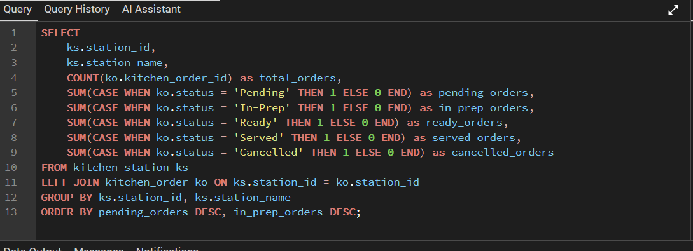
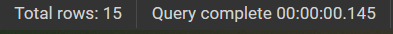
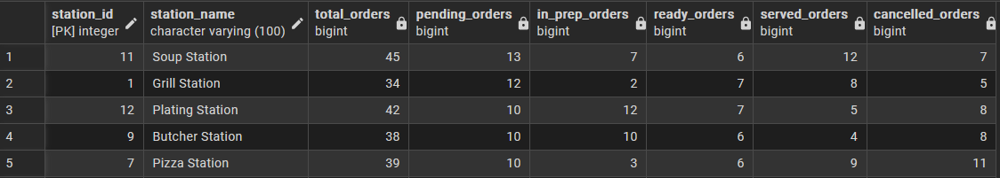

### PAIR 1B: Using CTE - קוד, הרצה ותוצאה
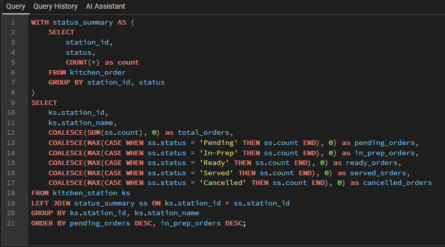
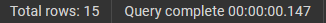
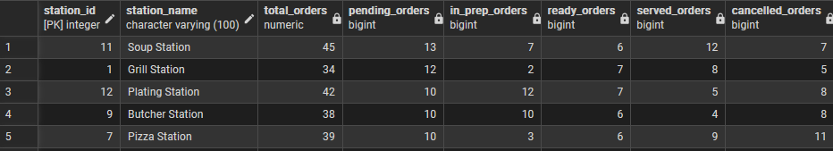

**הבדל יעילות:**
- **PAIR 1A (JOIN):** סריקה ישירה, מהיר עם indexes, כ-1 pass בלבד
- **PAIR 1B (CTE):** קריא יותר, ביצועים דומים עם indexes טובים

---

## 🔍 PAIR 2: High-Priority Chefs (IN vs EXISTS)

### PAIR 2A: Using IN - קוד, הרצה ותוצאה
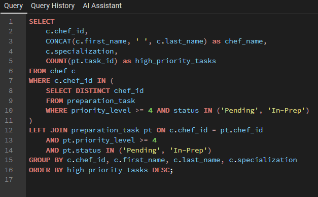

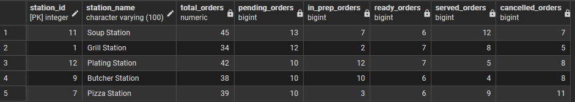

### PAIR 2B: Using EXISTS - קוד, הרצה ותוצאה
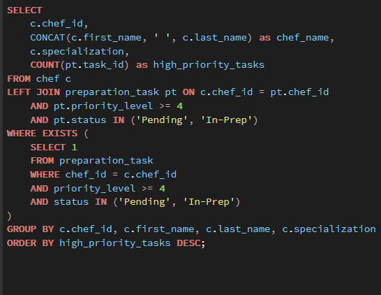
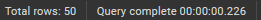
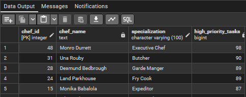

**הבדל יעילות:**
- **PAIR 2A (IN):** יוצר רשימה זמנית, טוב עם תוצאה קטנה
- **PAIR 2B (EXISTS):** קורלטיבי, מוצא רק הימצאות, יעיל עם תוצאה גדולה

---

## 🔍 PAIR 3: Order Duration (EXTRACT vs DATE_TRUNC)

### PAIR 3A: Using EXTRACT - קוד, הרצה ותוצאה
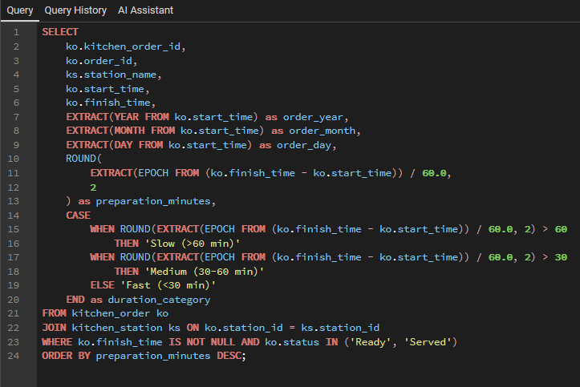
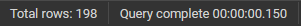
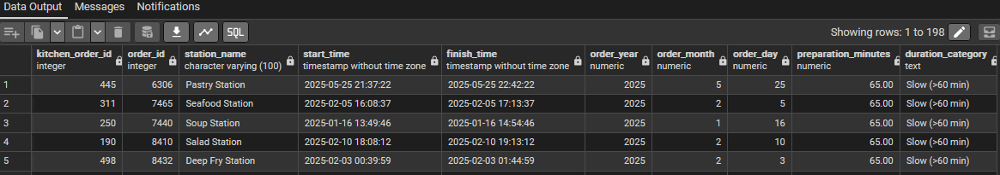

### PAIR 3B: Using DATE_TRUNC - קוד, הרצה ותוצאה
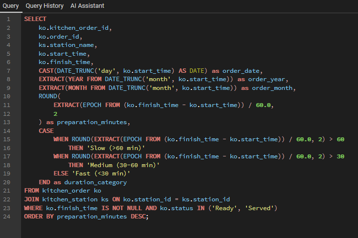
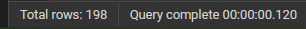
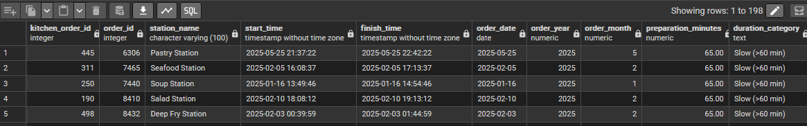

**הבדל יעילות:**
- **PAIR 3A (EXTRACT):** גמישות מקסימלית, כל חלק בנפרד
- **PAIR 3B (DATE_TRUNC):** מצוין לקיבוץ זמנים, timezone-safe

---

## 🔍 PAIR 4: Monthly Station Trends (EXTRACT vs DATE_TRUNC)

### PAIR 4A: Using EXTRACT - קוד, הרצה ותוצאה
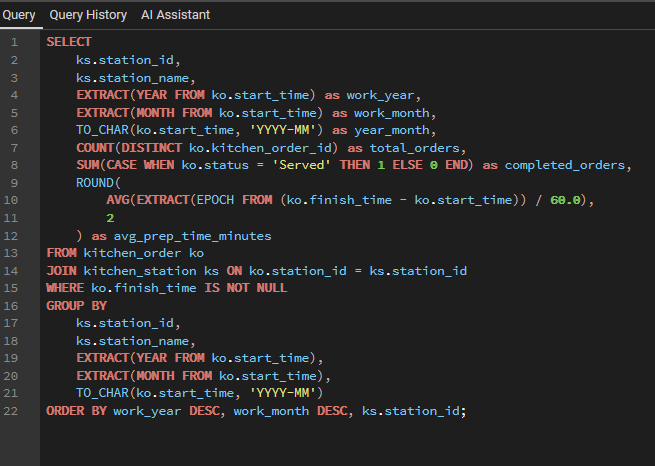

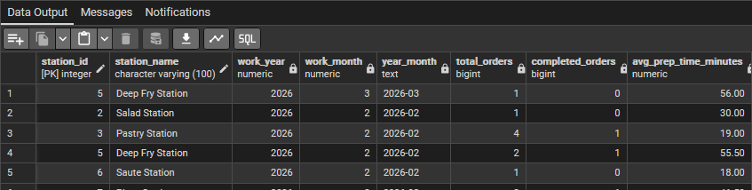

### PAIR 4B: Using DATE_TRUNC - קוד, הרצה ותוצאה
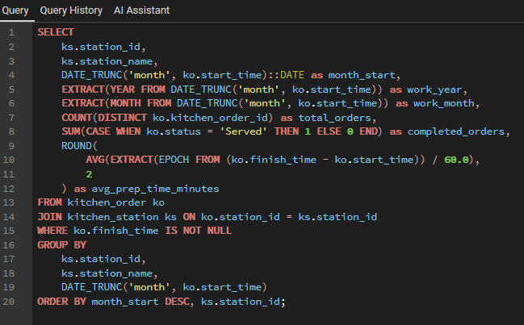

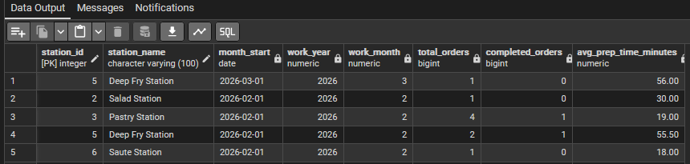

**הבדל יעילות:**
- **PAIR 4A (EXTRACT):** מספר קריאות לפונקציה
- **PAIR 4B (DATE_TRUNC):** פחות קריאות, consistent bucketing

---

## 📊 QUERY 5: Hygiene Inspection Scores
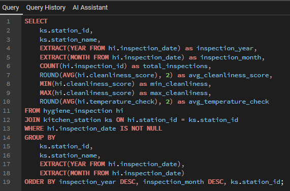
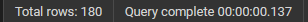
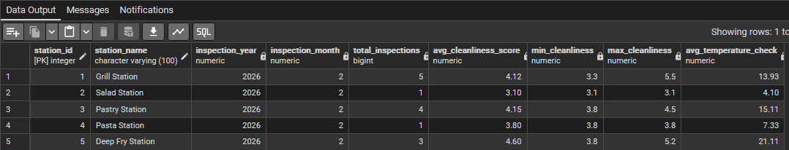

---

## 📊 QUERY 6: Chef Productivity
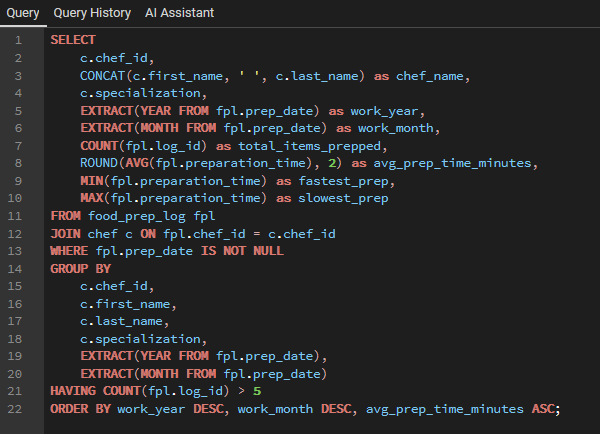
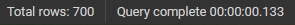
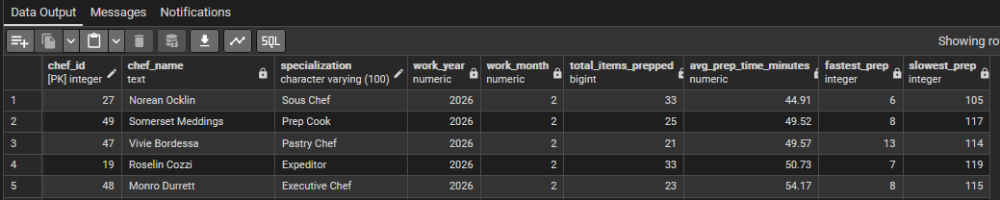

---

## 📊 QUERY 7: Active Tasks by Priority
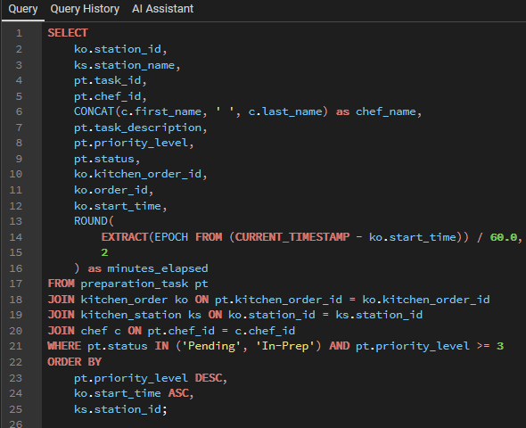

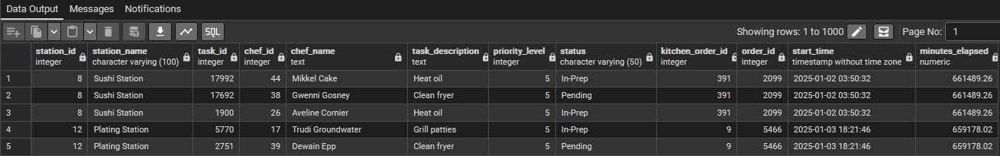

---

## 📊 QUERY 8: Temperature Anomalies
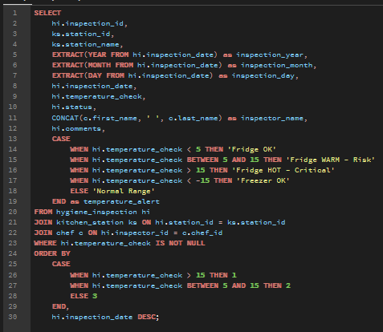
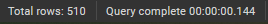
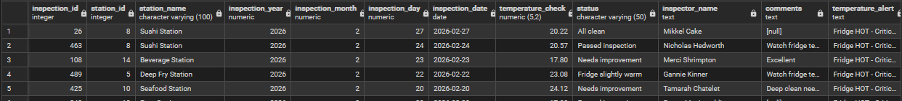

---

## ✏️ UPDATE 1: Orders Ready
**לפני:** 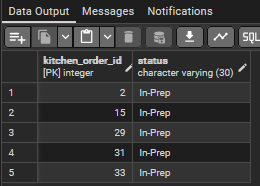
**הרצה:** 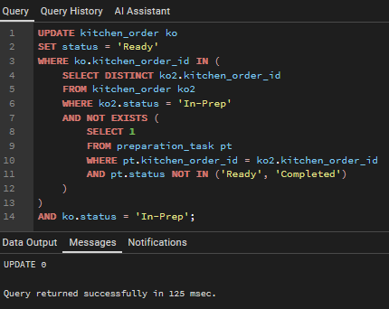
**אחרי:** 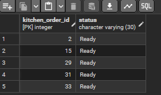

---

## ✏️ UPDATE 2: Chef Station Assignment
**לפני:** 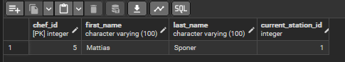
**הרצה:** 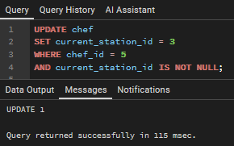
**אחרי:** 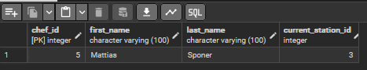

---

## ✏️ UPDATE 3: Next Inspection Date
**לפני:** 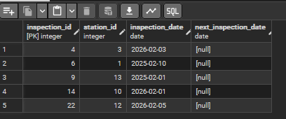
**הרצה:** 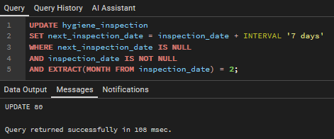
**אחרי:** 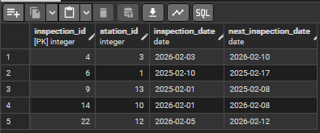

---

## 🗑️ DELETE 1: Old Cancelled Orders
**לפני:** 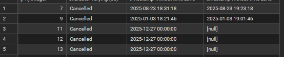
**הרצה:** 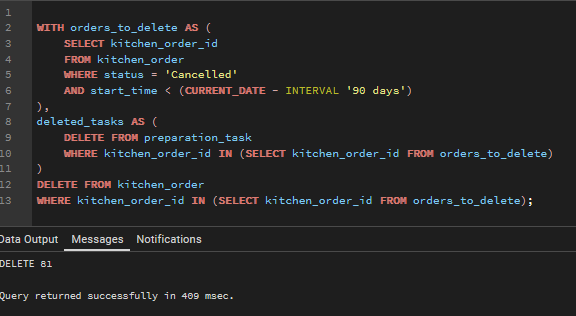
**אחרי:** 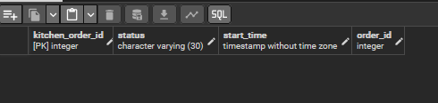

---

## 🗑️ DELETE 2: Duplicate Prep Logs
**לפני:** 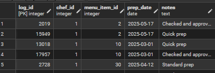
**הרצה:** 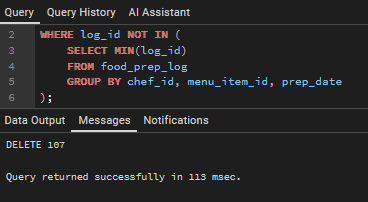
**אחרי:** 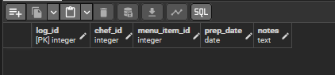

---

## 🗑️ DELETE 3: Tasks for Cancelled Orders
**לפני:** 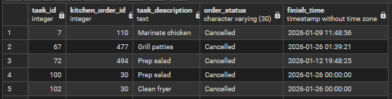
**הרצה:** 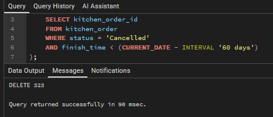
**אחרי:** 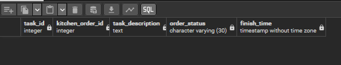

---

## 🔒 CONSTRAINT 1: Finish Time After Start
**ALTER:** 
**הפרה:** 
**שגיאה:** 

---

## 🔒 CONSTRAINT 2: Positive Prep Time
**ALTER:** 
**הפרה:** 
**שגיאה:** 

---

## 🔒 CONSTRAINT 3: Next Inspection After Current
**ALTER:** 
**הפרה:** 
**שגיאה:** 

---

## 🔒 CONSTRAINT 4: Valid Task Status
**ALTER:** 
**הפרה:** 
**שגיאה:** 

---

## 🔒 CONSTRAINT 5: Unique Station Names
**ALTER:** 
**הפרה:** 
**שגיאה:** 

---

## 🔒 CONSTRAINT 6: Hire Date Not Future
**ALTER:** 
**הפרה:** 
**שגיאה:** 

---

## 🔒 CONSTRAINT 7: Priority Level (1-5)
**הפרה:** 
**שגיאה:** 

---

## 🔒 CONSTRAINT 8: Cleanliness Score (1.0-10.0)
**הפרה:** 
**שגיאה:** 

---

## 🔄 ROLLBACK - Transaction Undo

---

## 🔄 COMMIT - Transaction Permanent

---

**סטטוס:** ✅ שלב ב' הושלם
**עדכון:** 06/04/2026
